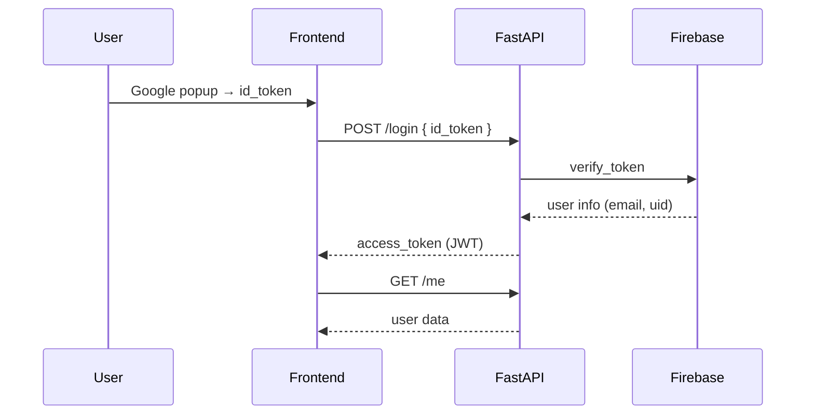

# Job Tracker App 🎉✨🚀

An end‑to‑end application suite engineered with **React (Vite)** and **FastAPI**, orchestrated via **PostgreSQL**, **Redis**, and Docker.  The system affords individual users a rigorous mechanism for cataloguing job‑search activities, while privileged administrators may curate vacancy postings, manage their lifecycle, and adjudicate application statuses. 🎉✨🚀

---

## 🚀 Quick Start 🎉✨🚀

```bash
# 1 – build & start the whole stack
docker compose up --build   # backend → :8000, frontend → :5173

# 2 – (optional) create tables manually inside the container
docker exec backend python app/scripts/create_tables.py
```

Navigate to [http://localhost:5173](http://localhost:5173) for the client interface and [http://localhost:8000](http://localhost:8000) for the API gateway. 🎉✨🚀

> **Tip:** Employ `Ctrl + Shift + R` to invalidate the browser cache and guarantee the most recent frontend assets. 🎉✨🚀

---

## 📦 Tech Stack 🎉✨🚀

| Layer     | Tech               | Purpose                                   |
| --------- | ------------------ | ----------------------------------------- |
| Front‑end | **React + Vite**   | Google OAuth integration, SPA UI          |
| Back‑end  | **FastAPI**        | JWT‑secured REST layer, business logic    |
| Database  | **PostgreSQL**     | ACID‑compliant persistence (SQLAlchemy)   |
| Cache     | **Redis**          | Temporal flags & opportunistic caching    |
| Dev Ops   | **Docker Compose** | Deterministic multi‑service orchestration |
| Email     | **SendGrid**       | Transactional mail delivery               |

---

## 📂 Project Structure 🎉✨🚀

```text
backend/
├── routes/
│   ├── admin.py
│   ├── auth.py
│   ├── available_jobs.py
│   └── jobs.py
├── utils/
│   └── email.py
├── background_tasks.py
├── database.py
├── main.py
├── models.py
└── schemas.py

frontend/
├── public/
│   └── bakgrunn.jpg
└── src/
    ├── api/
    │   └── axios.ts
    ├── components/
    │   ├── AvailableJobs.tsx
    │   ├── AvailableJobForm.tsx
    │   ├── AdminStatsPanel.tsx
    │   └── Navbar.tsx
    └── pages/
        ├── Dashboard.tsx
        ├── JobApplicationsAdmin.tsx
        └── LoginPage.tsx
```

---

## 🔐 Authentication Flow 🎉✨🚀

1. **Google Sign‑in** on the client yields an `id_token`. 🎉✨🚀
2. **POST /login** submits the token to FastAPI, which delegates verification to Firebase, materialises or retrieves the associated user, and issues a signed JWT. 🎉✨🚀
3. Subsequent protected endpoints mandate `Authorization: Bearer <jwt>`. 🎉✨🚀



---

## 🔄 Full Request / Response Flow 🎉✨🚀

```
Frontend (React / Postman)            FastAPI Backend                     Firebase
──────────────────────────            ─────────────────────────────────────────────
1. Google popup  ───────────►  id_token
                                  ┌─ 2. POST /login
                                  │   Body: { "id_token": "..." }
                                  │
                                  │   → verify_google_token()
                                  │       (POST identitytoolkit.googleapis.com
                                  │        ?key=<FIREBASE_API_KEY>)
                                  │   ← { users: [ { email, localId, ... } ] }
                                  │
                                  │   → fetch/create user in Postgres
                                  │   → generate JWT  { "user_id": 123, exp: … }
                                  └─ 3. 200 OK   { "access_token": "<JWT>", "token_type": "bearer" }

4. Any protected call (e.g. GET /me) ─► Header: Authorization: Bearer <JWT>
                                  ┌─ JWT decoded → user loaded → response
                                  └─ 200 OK   { "id": 123, "email": "...", "full_name": "..." }
```

---

## 📚 Key API Endpoints 🎉✨🚀

| Method              | Path              | Auth  | Description                         |
| ------------------- | ----------------- | ----- | ----------------------------------- |
| POST                | `/login`          | –     | Exchange Google token for JWT       |
| GET                 | `/me`             | ✔️    | Retrieve authenticated identity     |
| GET/POST/PUT/DELETE | `/available-jobs` | Admin | Administrative vacancy management   |
| POST                | `/apply/{job_id}` | User  | Instantiate application for vacancy |
| GET/POST/PUT/DELETE | `/jobs`           | User  | CRUD operations on personal record  |

> Comprehensive OpenAPI specifications reside at [http://localhost:8000/docs](http://localhost:8000/docs). 🎉✨🚀

---

## 📨 Email Notifications (SendGrid) 🎉✨🚀

A status mutation executed by an administrator asynchronously triggers `send_status_email()`, invoking the SendGrid transactional API to apprise the applicant. 🎉✨🚀

```python
send_status_email(
  to=user.email,
  user_name=user.full_name,
  job_title=job.job_title,
  company=job.company,
  new_status=job.status,
)
```

> ⚠️ SSL verification is intentionally disabled (`verify=False`) in development to expedite local testing; enable strict TLS validation prior to production deployment. 🎉✨🚀

Environment variables requisite for email transmission: 🎉✨🚀

```env
SENDGRID_API_KEY=SG.xxxxxx
FROM_EMAIL=sushant.nmbu@gmail.com  # verified sender ID
```

---

## 🗄️ Data Model (simplified) 🎉✨🚀

```
User           AvailableJob          JobApplication
———           —————————            ————————————
id (PK)        id (PK)               id (PK)
email          company               company
google_id      title                 job_title
is_admin       description           status
               company_link          link
               logo_url              notes
                                   → user_id (FK)
                                   → available_job_id (FK, cascade)
```

---

## ⚙️ Environment Variables (.env) 🎉✨🚀

| Key                       | Purpose                                         |
| ------------------------- | ----------------------------------------------- |
| `JWT_SECRET`              | HMAC secret for author‑signed JWTs              |
| `GOOGLE_FIREBASE_API_KEY` | External verifier for Google identity tokens    |
| `SENDGRID_API_KEY`        | Credential for SendGrid REST API                |
| `FROM_EMAIL`              | Authorised sender address (per SendGrid policy) |
| `DATABASE_URL`            | Postgres DSN (overridden by docker‑compose)     |

---

## 🧪 Curl Cheat‑Sheet 🎉✨🚀

```bash
# Login (replace <ID_TOKEN>)
curl -X POST http://localhost:8000/login -H 'Content-Type: application/json' \
     -d '{"id_token":"<ID_TOKEN>"}'

# Retrieve authenticated user’s jobs
curl -H "Authorization: Bearer <ACCESS_TOKEN>" \
     http://localhost:8000/jobs
```

---

## 🛣️ Roadmap 🎉✨🚀

- **Alembic migrations** → establish reproducible schema versioning
- **CI/CD** (GitHub Actions) → enforce automated testing and container publishing
- **Admin analytics dashboard** → integrate Recharts‑based visual insights
- **Soft‑delete semantics** → adopt `is_deleted` flag for logical removal
- **Document uploads** → enable CV PDF attachment per application

> 💡 Contributions are welcome—feel free to open issues or submit pull requests. Happy building! 🚀🎉✨

